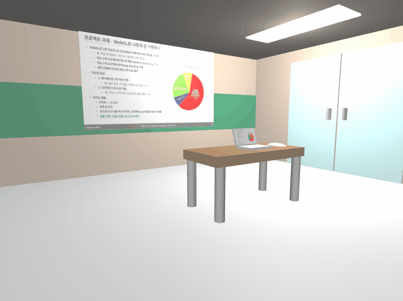

# 🎓 WebGL2 Interactive Lecture Room

WebGL2를 활용하여 구현한 3D 가상 강의실 프로젝트입니다. Phong Shading과 다양한 인터랙션 기능을 포함하고 있습니다.

[👉 라이브 데모 보기](https://jajaqyu.github.io/WebGL2-Interactive-Lecture-Room/)
## 🚀 주요 기능 (Key Features)

* **Phong Shading & Lighting**: 
  - Directional Light와 거리 감쇠(Attenuation)가 적용된 Point Light 구현
  - 물체별 Material 속성(Ambient, Diffuse, Specular, Shininess) 정의
* **Texture Mapping**: 
  - 외부 이미지(`texture1.png`)를 활용한 노트북 화면 및 강의실 대형 스크린 텍스처링
* **Interactions**: 
  - **마우스 드래그**: 노트북 화면의 회전 각도 조절
  - **마우스 휠**: 카메라 Zoom In/Out 및 책상 시점으로의 시선 이동
* **3D Modeling**: 
  - Cube, Cylinder, Sphere 프리미티브를 활용한 강의실 환경 구성

## 🛠 기술 스택 (Tech Stack)

* **Language**: JavaScript (ES6+)
* **Graphics API**: WebGL2
* **Library**: gl-matrix (행렬 연산)

## 💻 실행 방법

이 프로젝트는 WebGL2 모듈(`type="module"`)을 사용하므로, 보안 정책상 로컬 서버 환경에서 실행해야 합니다.

1. 이 레포지토리를 클론(Clone)합니다.
2. 아래 방법 중 하나로 실행하세요:
   * **VS Code 사용자**: `Live Server` 확장 프로그램을 설치한 후, `index.html`에서 'Go Live'를 클릭합니다.
   * **Python 사용자**: 터미널에서 `python -m http.server 8000` 입력 후 `localhost:8000` 접속
   * **Node.js 사용자**: `npx serve` 입력 후 제공된 주소로 접속
3. 또는 상단의 **라이브 데모 링크**를 클릭하여 웹에서 바로 확인하세요.